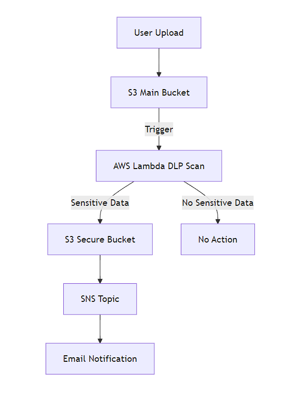

# Cloud DLP System using AWS (Terraform)

## Overview

This project implements a **Data Loss Prevention (DLP) system** using AWS services. It automatically scans files uploaded to an S3 bucket and detects sensitive information such as emails, PAN, Aadhaar, and more. If sensitive data is found, the file is secured and an alert is sent.

## How It Works

1. A user uploads a file to the **Main S3 Bucket**
2. The upload triggers an **AWS Lambda function**
3. The Lambda function:
   * Reads the file
   * Scans for sensitive data (PII)
4. If sensitive data is detected:
   * File is moved to a **Secure S3 Bucket**
   * An **email alert** is sent using SNS
5. If no sensitive data is found:
   * File remains in the main bucket


## Architecture




## Technologies Used

- AWS S3
- AWS Lambda
- AWS SNS
- AWS KMS
- Terraform
- Python


## Project Structure

```text
.
├── provider.tf           # Provider configuration
├── variables.tf          # Input variables
├── terraform.tfvars      # Variable values (ignored in Git)
├── s3.tf                 # S3 bucket resources
├── lambda.tf             # Lambda function setup
├── iam.tf                # IAM roles & policies
├── kms.tf                # KMS encryption setup
├── sns.tf                # SNS notifications
├── lambda_function.py    # Lambda source code
└── lambda_function.zip   # Deployment package
```

File Description

### provider.tf

Configures AWS provider and region.

### variables.tf

Defines input variables for flexibility (bucket names, email, etc).

### s3.tf

* Creates main and secure S3 buckets
* Enables encryption using KMS for secure bucket

### lambda.tf

* Creates Lambda function
* Adds S3 trigger
* Passes environment variables

### iam.tf

* Creates IAM role for Lambda
* Grants permissions:

  * S3 access
  * SNS publish
  * Logging

### kms.tf

* Creates KMS key
* Used for encrypting secure bucket

### sns.tf

* Creates SNS topic
* Sends alerts via email

### lambda_function.py

Contains the core DLP logic:

* Reads file content
* Detects PII using regex
* Moves sensitive files
* Sends alerts


## Setup Instructions

### 1. Clone the repository

### 2. Create a file named:

terraform.tfvars

### 3. Add your configurationin the terraform.tfvars folder:

aws_region            = "ap-south-1"
main_bucket_name      = "your-main-bucket"
secure_bucket_name    = "your-secure-bucket"
lambda_function_name  = "your-lambda-name"
sns_topic_name        = "your-topic"
subscription_email    = "your-email@gmail.com"

### 4. Initialize Terraform

terraform init

### 5. Deploy resources

terraform plan
terraform apply


### 6. Confirm SNS Subscription

Check your email and click **Confirm Subscription**


## Testing

1. Upload a file to the main bucket
2. Add sensitive data (example: email ID)
3. Verify:

   * File moves to secure bucket
   * Email alert is received


## Security Features

1 KMS-based encryption
2 IAM least privilege access
3 Event-driven processing
4 Automated response to sensitive data


##  Notes

1 SNS email requires manual confirmation
2 terraform.tfvars should not be uploaded
3 Bucket names must be globally unique


## Future Improvements

1 Add support for PDFs and images
2 Add dashboard for monitoring
3 Add severity-based detection
4 Integrate with SIEM tools


Cloud security project built using AWS and Terraform.
